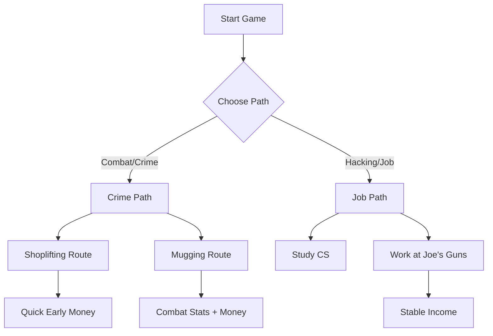

# Bitburner Faction & Company Progression Guide
*Complete Step-by-Step Roadmap with Requirements*

## Phase 1: Early Game Foundation (BitNode 1 Start)

### Step 1: Initial Setup - Choose Your Path

- **Goal**: Build basic stats and money
- **Option A - Crime Path** (Popular early strategy):
  
  **Shoplifting Route (Recommended for beginners):**
  1. **Train at gym first**: Go to Powerhouse Gym in Sector-12
     - Train Dexterity to 25+ (primary stat for shoplifting success)
     - Train Agility to 25+ (secondary stat for shoplifting success) 
     - This takes ~30-45 minutes of focused training
  2. **Commit Shoplifting crimes**: Go to City → The Slums
     - **Base reward**: ~$15,000 per attempt
     - **Time**: 2 seconds per attempt
     - **Success rate**: ~90%+ with 25 Dex/Agility
     - **Advantage**: Very fast, constant clicking, good early money
     - **Target**: Earn $1,000,000 for Tian Di Hui faction requirement
  
  **Mugging Route (Alternative):**
  1. **Train combat stats**: Go to Powerhouse Gym
     - Train Strength to 50+ (primary stat for mugging)
     - Train Defense, Dexterity, Agility to 20+ each
     - This takes ~1-2 hours of focused training
  2. **Commit Mugging crimes**: Go to City → The Slums  
     - **Base reward**: ~$36,000 per attempt
     - **Time**: 4 seconds per attempt
     - **Success rate**: ~85%+ with proper stats
     - **Advantage**: Higher payout per attempt, less clicking

- **Option B - Job Path**:
  1. Study Computer Science at university until Hacking 50
  2. Work at Joe's Guns for steady income ($110/sec) while doing other activities
- **Both paths**: Build Hacknet nodes for passive income once you have some starting capital

> [!TIP]
> **Automation Potential**: While you can't automate gym training or crime early on (requires Singularity API), you *can* and *should* automate the creation of hacking scripts. Even in BN1, your home computer can run scripts to hack servers while you manually do crimes.

### Step 2: First Faction - CyberSec
- **Requirements**: 
  - Hack CSEC server manually
  - No stat requirements
- **How to unlock**:
  1. Get basic hacking skill (20+)
  2. Use `scan-analyze` to find CSEC server
  3. Use `nuke` command to hack it
  4. Wait for faction invitation
- **Priority Augmentations**: 
  - Augmented Targeting I (+15% dexterity exp)
  - Neurotrainer I (+10% all exp)

### Step 3: Tian Di Hui
- **Requirements**:
  - $1,000,000
  - Hacking level 50
  - Be in Chongqing, New Tokyo, or Ishima
- **How to unlock**:
  1. Travel to Chongqing (cheapest option)
  2. Ensure you have $1M and Hacking 50
  3. Wait for invitation
- **Key Augmentations**: 
  - Neuroreceptor Enhancement (+10% all exp)
  - Speech Enhancement (+10% company rep and charisma exp)

## Phase 2: Building Infrastructure

### Step 4: Hacknet Faction - Netburners
- **Requirements**:
  - Total Hacknet levels: 100
  - Hacking level: 80
  - Total Hacknet RAM: 8
  - Total Hacknet Cores: 4
- **Strategy**:
  1. Buy 4 Hacknet nodes
  2. Upgrade each to level 25 (4 × 25 = 100 total levels)
  3. Buy 2 RAM upgrades for each (4 × 2 = 8 total RAM)
  4. Buy 1 core upgrade for each (4 × 1 = 4 total cores)
- **Key Augmentations**: 
  - Hacknet Node CPU Architecture (+20% hacknet production)
  - Hacknet Node NIC Architecture (+20% hacknet production)

> [!TIP]
> **Automation Potential**: Hacknet Nodes are the easiest thing to automate early. Write a script using `hacknet.purchaseNode()`, `hacknet.upgradeLevel()`, etc., to manage this entirely in the background.

### Step 5: First Company Job
- **Recommended Company**: ECorp or MegaCorp
- **Position**: Start with Software Engineer, work toward Senior positions
- **Goal**: Build to 200,000 company reputation
- **Important**: You need **375+ Charisma** to get faction invitations from megacorp companies
- **Strategy**:
  - Work Software job to build company reputation (click "Work" button manually)
  - Your hacking skill will increase naturally from working Software jobs
  - Manually switch to university Leadership classes to build Charisma to 375+
  - Balance between company work and charisma training - you MUST hit 375 charisma

## Phase 3: Hacker Group Progression

### Step 6: NiteSec
- **Requirements**:
  - Hack `avmnite-02h` server manually
  - Home RAM ≥ 32 GB
- **Preparation**:
  1. Upgrade home RAM to 32 GB (costs ~$1.28M)
  2. Increase hacking level to ~200
  3. Get required programs: BruteSSH.exe, FTPCrack.exe
- **Key Augmentations**: 
  - CRTX42-AA Gene Modification (+8% hacking exp)
  - Neural-Retention Enhancement (+25% all exp)

### Step 7: The Black Hand
- **Requirements**:
  - Hack `I.I.I.I` server manually
  - Home RAM ≥ 64 GB
- **Preparation**:
  1. Upgrade home RAM to 64 GB (costs ~$5.12M)
  2. Hacking level ~350
  3. Need: BruteSSH.exe, FTPCrack.exe, relaySMTP.exe
- **Key Augmentations**: 
  - The Black Hand (+10% all stats, +15% hacking money)
  - Neural Accelerator (+10% all exp)

### Step 8: BitRunners
- **Requirements**:
  - Hack `run4theh111z` server manually
  - Home RAM ≥ 128 GB
- **Preparation**:
  1. Upgrade home RAM to 128 GB (costs ~$20.48M)
  2. Hacking level ~500+
  3. Need: BruteSSH.exe, FTPCrack.exe, relaySMTP.exe, HTTPWorm.exe
- **Key Augmentations**: 
  - BitRunners Neurolink (+5% all stats, +15% hacking money)
  - Neural Accelerator (+10% all exp)

## Phase 4: Company Factions

### Step 9: First Megacorp Faction
- **Target**: ECorp, MegaCorp, or Four Sigma
- **Requirements**: 200,000 company reputation
- **Strategy**:
  1. Get promoted to Senior Software Engineer or higher
  2. Work until 200,000 rep (takes 50-100 hours depending on stats)
  3. Accept faction invitation when it appears
- **Focus**: Augmentations that boost hacking exp and money

### Step 10: Fulcrum Secret Technologies (Special)
- **Requirements**:
  - Work for Fulcrum Technologies
  - 200,000 company reputation  
  - Hack `fulcrumassets` server manually
- **Preparation**:
  1. Apply to Fulcrum Technologies
  2. Work to 200k rep
  3. Hack the server (requires high hacking level ~700+)
- **Key Augmentation**: 
  - Fulcrum Secret Technologies (Major hacking boost)

## Phase 5: City Factions (Choose Path)

### Option A: High-End Path
**Step 11A: Volhaven**
- **Requirements**:
  - Be in Volhaven
  - $50,000,000
  - Cannot be in other city factions
- **Strategy**: Save money through hacking/company work, then travel to Volhaven

### Option B: Alternative Path  
**Step 11B: Aevum**
- **Requirements**:
  - Be in Aevum
  - $40,000,000
- **Strategy**: Cheaper alternative to Volhaven

## Phase 6: Criminal Organizations (Optional)

### Step 12: Slum Snakes (Easiest Criminal)
- **Requirements**:
  - All combat stats ≥ 30
  - Karma ≤ -9
  - $1,000,000
- **How to get negative karma**:
  1. Work for criminal organizations
  2. Commit crimes (homicide gives most negative karma)
  3. Use "City" menu to commit crimes repeatedly

### Step 13: Higher Criminal Factions
**Tetrads**:
- All combat stats ≥ 75
- Karma ≤ -18
- Be in Chongqing, New Tokyo, or Ishima

**The Syndicate**:
- Hacking ≥ 200, All combat stats ≥ 200
- Be in Aevum or Sector-12
- $10,000,000, Karma ≤ -90
- NOT working for CIA or NSA

## Phase 7: Endgame Preparation

### Step 14: Augmentation Strategy & First Reset
- **Goal**: Purchase and install your first set of augmentations
- **Critical Strategy**:
  1. **Buy expensive augmentations first** - Each purchase increases ALL prices by 90%
  2. **Prioritize experience multipliers**: Neurotrainer I, Neural-Retention Enhancement
  3. **Get faction reputation multipliers** for faster future faction grinding
  4. **Upgrade home RAM to maximum possible** before installing (RAM persists through resets)
  5. **Don't rush augmentations** - early game, RAM upgrades > augmentations for profit
  6. **Install all purchased augmentations** - this resets your progress but makes you permanently stronger
- **Recommended first augmentations** (in price order):
  - NeuroFlux Governor (multiple levels, small all-around boost)
  - BitWire (+5% hacking chance and speed)
  - Neurotrainer I (+10% all experience gain)
- **Reset timing**: Don't reset until you have substantial augmentations and maxed home RAM - the reset is permanent!

### Step 15: Endgame Factions

**The Covenant**
- **Requirements**:
  - 30 augmentations
  - $75,000,000,000
  - Hacking ≥ 850
  - All combat stats ≥ 850

**Daedalus**
- **Requirements**:
  - 30 augmentations  
  - $100,000,000,000
  - Hacking ≥ 2500 OR all combat stats ≥ 1500

**Illuminati** 
- **Requirements**:
  - 30 augmentations
  - $150,000,000,000  
  - Hacking ≥ 1500
  - All combat stats ≥ 1200

## Key Tips for Success

### Augmentation Purchase Strategy
- **Critical**: Purchasing multiple Augmentations before installing them will cause the Augmentations to get progressively more expensive. When you purchase an Augmentation, the price of purchasing another Augmentation doubles
- **Best practice**: Buy the most expensive augmentations first in each reset cycle
- **Priority augmentations**: Early-game, the most useful augmentations boost "faction reputation" and "hacking multiplier / experience / speed / money"
- **Home RAM preservation**: Your home server RAM is *NOT* reset the way your purchased programs/servers are, so you should prioritise upgrading home RAM over spending a lot of money on new servers, especially leading up to an Augmentation

### Early Automation Scripts
- Start with simple hack/grow/weaken scripts for target servers
- Write a control script that we run on our home computer, which can spawn weaken.ns grow.ns and hack.ns on other servers – leaving us with all their memory free for doing important jobs
- Basic target priority: Weaken security → Grow money → Hack for profit
- You need to connect to a server, nuke it, and begin weakening its security while growing its money reserves for you to hack

### Reputation Grinding
- **Software Engineer jobs** give highest reputation multiplier
- **Faction work** types ranked by rep gain:
  1. Hacking Contracts (best for hacking factions)
  2. Field Work (good balance)
  3. Security Work (lowest but builds combat stats)

### Money Making
- **Server hacking** is most efficient early-game money source
- **Stock market trading** becomes very profitable with capital and WSE access ($200M+ for TIX API)
- **Company salary** provides steady income
- **Hacknet nodes** give passive income
- Focus on servers with highest money available
- Stock trading strategy: Use 4S Market Data + forecast algorithms for consistent profits

### Stat Building
- **Universities** for hacking (Computer Science), charisma (Leadership)
- **Gyms** for combat stats (strength, defense, dexterity, agility) - only needed for criminal factions
- **Faction work** builds relevant stats while gaining rep
- **Crime** for combat stats and negative karma
- **Key requirement**: 375+ Charisma is essential for all megacorp faction invitations

### Programs Needed
Essential hacking programs in order:
1. **BruteSSH.exe** - Opens SSH ports
2. **FTPCrack.exe** - Opens FTP ports  
3. **relaySMTP.exe** - Opens SMTP ports
4. **HTTPWorm.exe** - Opens HTTP ports
5. **SQLInject.exe** - Opens SQL ports

### Programming Requirements by Job Level
- **Business Analyst**: No programming requirement
- **Business Consultant**: No programming requirement  
- **Senior Business Consultant**: No programming requirement
- **Software Engineer**: Programming 75
- **Senior Software Engineer**: Programming 200, Charisma 75
- **Lead Software Developer**: Programming 400, Charisma 150
- **Head of Software**: Programming 500, Charisma 250
- **Head of Engineering**: Programming 750, Charisma 500
- **Vice President of Technology**: Programming 1200, Charisma 1000

### Reset Cycle Strategy
- **First Reset**: After getting 5-10 key augmentations from early factions
- **Each Subsequent Reset**: Becomes faster due to permanent stat bonuses
- **Long-term Goal**: Build up to 30+ augmentations for endgame factions
- **BitNode Progression**: After mastering BitNode-1, consider other BitNodes for unique rewards

### Available Terminal Commands (BitNode-1)
Basic commands available from the start:
- `scan-analyze` - Find available servers to hack
- `connect [server]` - Connect to a server
- `nuke [server]` - Hack a server after meeting port requirements
- `run [script.js]` - Execute your hacking scripts
- `ls` - List files on current server (look for .cct contract files)
- `home` - Return to home server
- **Programming contracts**: Look for .cct files on servers - these can give massive money rewards ($250M each)

**Note**: All faction work, company work, training, and crime activities must be done manually through the GUI in your first playthrough. Automation features are not available until later BitNodes.